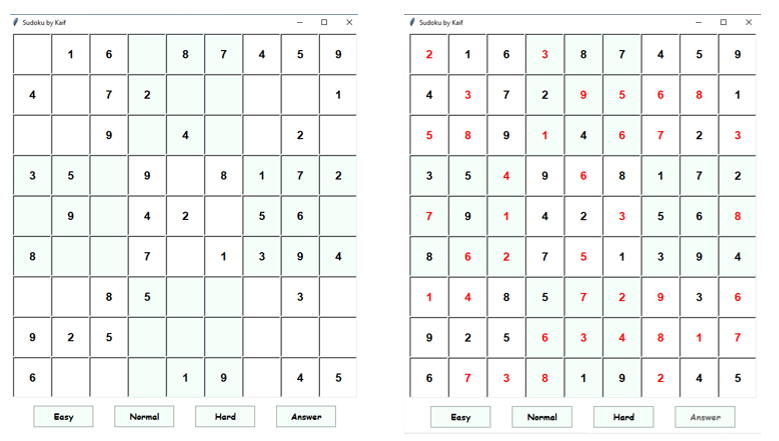
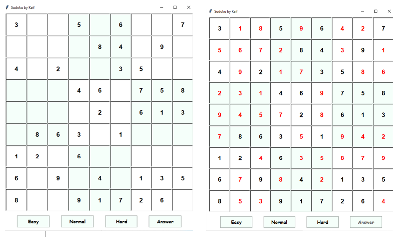
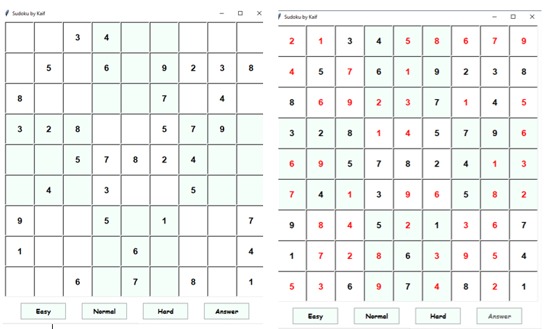

# Sudoku

Sudoku is a puzzle game designed for a single player, much like a crossword puzzle. The puzzle itself is nothing more than a grid of little boxes called “cells”. They are stacked nine high and nine wide, making 81 cells total. The puzzle comes with some of the cells (usually less than half of them) already filled in.

There are over 6 billion trillion different valid puzzle combinations (or “solutions”) in standard Sudoku (OK, math was used to calculate that).And with each of these 6 billion trillion solutions, there are many, many different starting puzzles “hidden” inside.
Suffice it to say that we will never run out of new, unique puzzles – of any difficulty level!

In this particular code we have three different levels-
          
          1.easy
          2.normal
          3.hard

# Easy

# Normal

# Hard

# Algorithm
The algorithm which we are going to use in this particular code is *Backtracking* The way backtracking works to solve a Sudoku is that it solves the board from top-left tile to bottom-right tile. It tries a 'move' and if the move works according to Sudoku rules, do the same on the next tile. If no moves are valid, go back a tile and continue from where it was. Repeat the process until there is a solution to the Sudoku. The complexity is of O(n^2). Backtracking is implemented by recursion.

# Working
This program generates its own Sudoku and randomly generating filling up the Sudoku, then solve the Sudoku, and make hole in the solution board according to the difficulty. This is faster and more reliable than purely generating a board by filling up the Sudoku with X amount of givens, because often there were no solutions. Board generated properly are stored in a file such that if the program takes too long to generate a random board, it can access randomly a pre-generated board for a faster and reliable user-experience.

# Run
To play the game just give this command in cmd-

    python sudoku.py
    
To give the input of numbers in game just Press on a tile to increment the tile's move to 1. Press X amount of times, to have desired move. To reset tile to an empty tile, simply press on tile when it is at 9.

I hope you people enjoyed the game.
So, That's all for now!
Have Fun :-)

